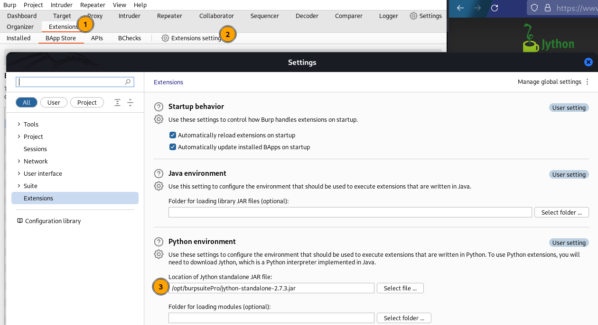
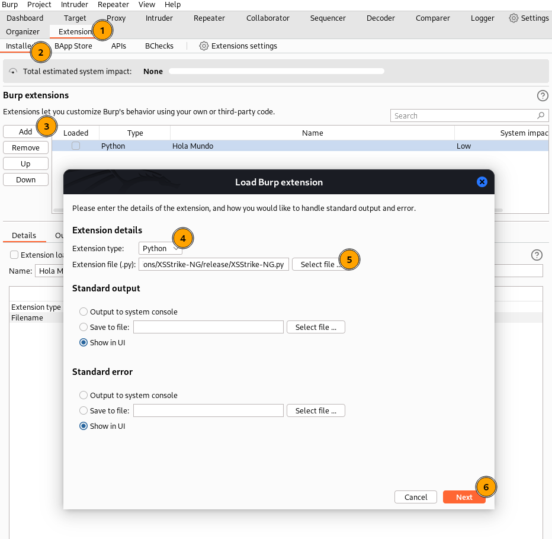
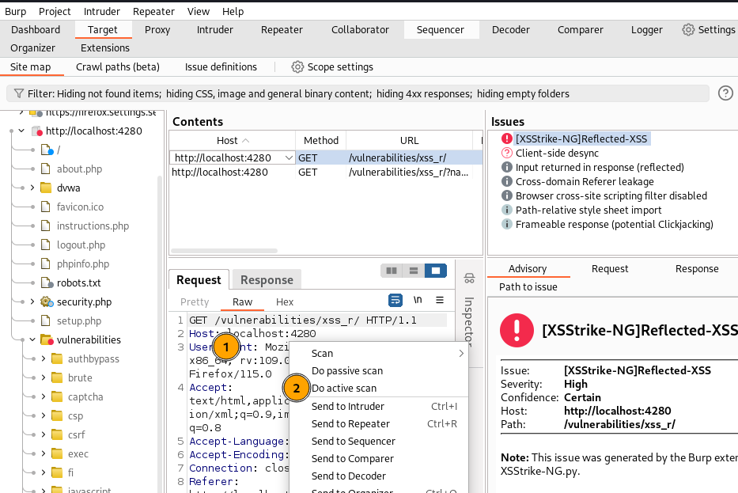
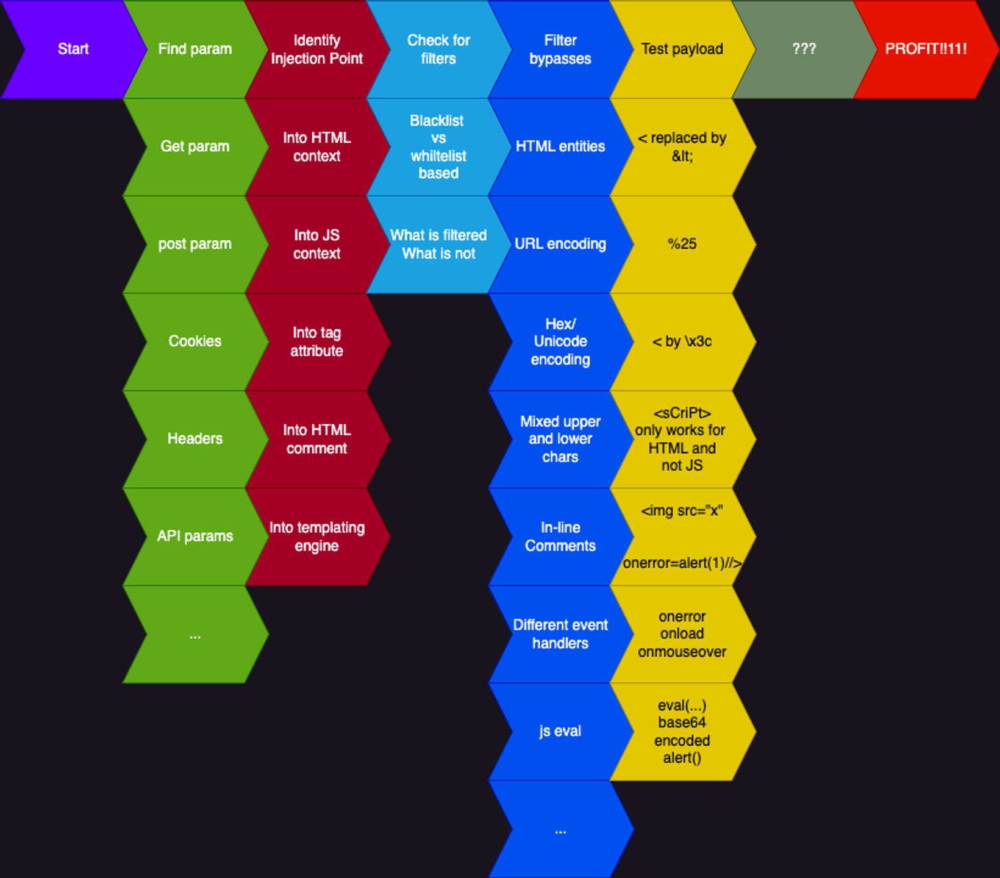

# XSSStrike-NG

## Vision

**XSSStrike-NG** is a BurpSuite plugin that facilitates a quick and intense identification of Cross-Site Scripting (XSS) vulnerabilities. This plugin assists the pentester by automating certain tasks to provide a quick overview of XSS exploitability.

## Features

### Dom-XSS

- Static analysis in passive mode

### Reflected-XSS

- **EntryPoints Identification**: In active mode, it searches for potential injection points in HTTP requests.

- **Context Identification**: Identifies the context in which the injection was executed. The contexts identified so far are: 
	- HTML: `<div>XsStRIke</div>`
        - Attribute HTML: ``
        - Event HTML: `<button onclick="alert('XsStRIke')">Click me</button>`
        - CSS: `<style>body {background-image: url('XsStRIke');}</style>`
	- JavaScript: `<script>var data = "XsStRIke";</script>`

## Requirements

- [Jython Standalone](https://www.jython.org/download.html)

## Installation

To install the plugin, follow these steps:

1. Configure the Jython path in BurpSuite:



2. Download this repo
```shell
git clone https://github.com/soy-oreocato/XSStrike-NG.git
```

3. Install the plugin file (XSStrike-NG.py) in BurpSuite :



## Usage

To use the plugin, follow these steps:

1. Select the request or site and initiate the active scan in Burp.




## Future Work

Improve the process in any of the following stages:

**Source**: [XSS Rat Notion](https://thexssrat.notion.site/XSS-0ad0878f33094ea6b8ac90e94c2b0dc2)


## How to Contribute

- Suggest a feature

- Report a bug

- Fix something and open a pull request

## Acknowledgments

[Alaeddine Mesbahi](https://twitter.com/3asm_) for his inspiring article: [Finding superhuman XSS polyglot payloads with Genetic Algorithms](https://blog.ostorlab.co/polyglot-xss.html)

[Uncle Rat](https://x.com/theXSSrat) for his valuable tutorials that helped to better understand this vulnerability.


## License

Licensed under the GNU GPLv3, see LICENSE for more information.
